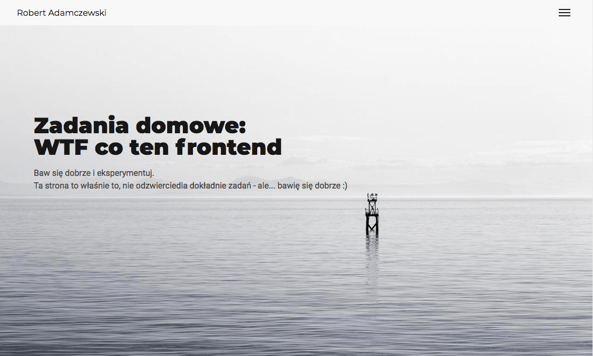

# wtf-homepage

[wtf homepage project website](https://rogreyroom.github.io/wtf-homepage/)



## Build with

The project is built with the use of the _gulp_ task runner.

The gulp configuration uses [babeljs](https://babeljs.io/) for ES6 and the new [gulp4](https://gulpjs.com/) syntax. It also uses [browser sync](https://www.browsersync.io/) to watch changes in your files and updating connected browsers.

It contains:

- gulp
- gulp-babel
- gulp-sass
- gulp-autoprefixer
- gulp-concat
- gulp-uglify
- gulp-rename
- gulp-imagemin
- gulp-sourcemaps
- gulp-clean-css
- del
- browser-sync

### Working directory

Working directory for the project is **src** folder with subfolders:

- js - to write javascript (it can contain many files which will be concat to one "main.min.js" file)
- images - gulp will compress them
- html - for html files
- scss - write your scss files according to the folders' names - the output will be style.min.css

### Using gulp

- development - run `gulp` or `npm start`
- production - run `gulp build` or `npm build`
- deployment - follow deploy section

## Deploy

To deploy public folder to **gh-pages** brunch

```git
> git checkout gh-pages
> git checkout [master/feature-branch] -- 'public/**'
> git rm -f -r --ignore-unmatch ./**
> git mv -f public/** ./
> git commit . -m "build: website deploy `date +\"%Y-%m-%d\"`"
```
